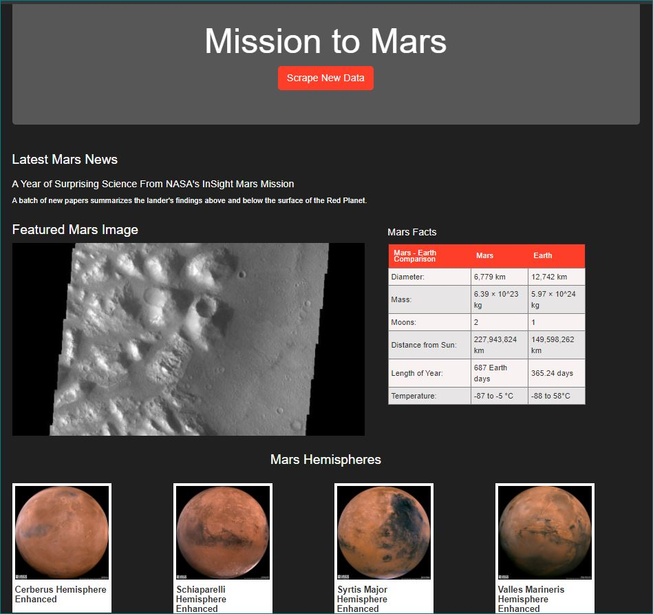

# Web Scraping - Mission to Mars
In this project, we will build a web application that scrapes various websites for data related to the Mission to Mars and displays the information in a single HTML page.

## Step 1 - Scraping
In the Jupyter Notebook called `mission_to_mars.ipynb`, BeautifulSoup, Pandas, and Requests/Splinter were used to scrape the following.

### NASA Mars News

* This [Mars News Site](https://redplanetscience.com/) was scraped to collect the latest News Title and Paragraph Text.

### JPL Mars Space Images - Featured Image

* The [Featured Space Image site](https://spaceimages-mars.com) was used to scrape the page's featured image.

### Mars Facts

* [The Mars Facts webpage](https://galaxyfacts-mars.com) was scraped using Pandas to get the table containing facts about the planet including Diameter, Mass, etc. and convert it into an HTML table.

### Mars Hemispheres

* Images of the Mars hemispheres were scraped from [this astrogeology site](https://marshemispheres.com/) to obtain URL for each image of Mars' hemispheres.

- - -

## Step 2 - MongoDB and Flask Application

The `app.py` file is a flask app with a local connection to MongoDB. A styled template is used to render the data collected in Step 1.

* The Jupyter notebook above was converted into a Python script called `scrape_mars.py` with a function called `scrape` that executes our scrape code from the websites where the data changes (the news title/text and the featured image). This scraped data is returned in one dictionary and upserted into MongoDB, then rendered on the page.

- - -

* A screenshot of the final application:

